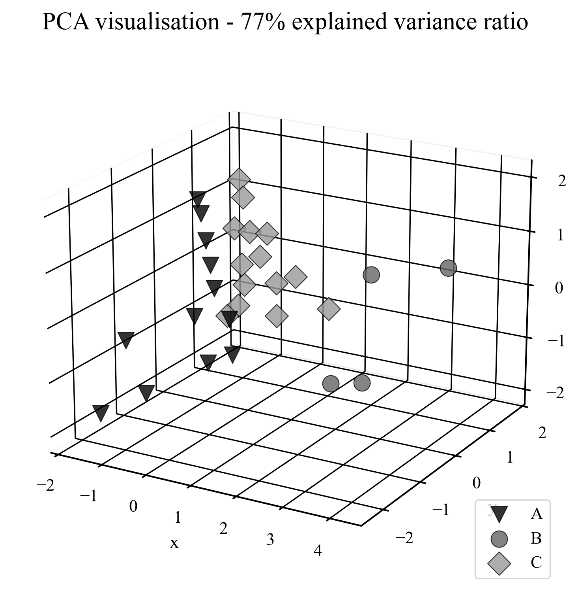

# 📈 WIG30 Stock Segmentation: K-Means Clustering Analysis

This project investigates the utility of the **K-Means clustering method** for segmenting companies listed on the **WIG30 index** (Warsaw Stock Exchange) based on key financial indicators. 

The analysis was conducted as part of a Bachelor’s Thesis to determine if machine learning can effectively group listed companies into meaningful clusters based on their financial performance.

---

## ✨ Key Features & Methodology

### 🔍 Feature Engineering & Data Collection
* **Web Scraping**: Financial statements were extracted from professional financial portals: **Stockwatch** and **Stooq**.
* **Custom Indicators**: Raw financial data was processed through custom functions to calculate specific financial ratios.
* **Data Privacy**: Please note that the raw scraped data is not included in this repository due to terms of service.
* **Scientific Grounding**: The selection of specific financial variables is based on an in-depth analysis documented in the associated Bachelor's Thesis.

### 🧪 Data Preprocessing & EDA
Before clustering, the dataset underwent rigorous **Exploratory Data Analysis (EDA)**:
* **Feature Selection**: Variables with high multi-collinearity were removed to ensure model stability.
* **Outlier Treatment**: Identification and management of extreme values to prevent distortion of cluster centroids.

### 🤖 Clustering Pipeline
The project implements a robust machine learning pipeline:
1.  **Elbow Method**: Used to determine the optimal number of clusters ($k$).
2.  **Standardization**: Scaling features to ensure equal weight during distance calculation.
3.  **Winsorization**: Statistical transformation to limit the influence of outliers.
4.  **K-Means Algorithm**: The final segmentation of WIG30 companies.

🤖 Dimensionality Reduction: PCA
To visualize the multi-dimensional dataset and understand the clustering quality, Principal Component Analysis (PCA) was applied.

  

## 📈 Strategy Validation & Results

To verify the effectiveness of the segmentation, three investment portfolios (**A, B, and C**) were constructed based on the identified clusters. Their performance was backtested against the **WIG index** benchmark using 2025 price data.

### Investment Strategies
The clustering analysis allowed for the definition of three distinct investment strategies:
1.  **Offensive Portfolio**: High-growth companies with higher volatility, aimed at outperforming the market during bullish trends.
2.  **Defensive Portfolio**: Stable companies with strong financial health, designed to preserve capital and provide steady returns.
3.  **Future Potential Portfolio**: Companies showing specific financial patterns that suggest undervalued growth opportunities for the long term.

### Performance Comparison 
The chart below illustrates the cumulative returns of the three portfolios and WIG index in 2025:

---

## 🛠️ Tech Stack
* **Language**: Python
* **Libraries**: 
    * `pandas`, `numpy` (Data Manipulation)
    * `scikit-learn` (Machine Learning Pipeline & K-Means)
    * `requests` (Web Scraping)
    * `matplotlib`, `seaborn` (Visualization)
    * `scipy` (Statistical Transformations)

---

## 🚀 Project Structure
* `src/`: Scripts for web scraping, indicator calculation, final pipeline and others.
* `notebooks/`: Notebooks containing conducted analysis and visualisations.
* `charts/`: Image files with created charts.
* `data/`: Useful data files.

---

## 📝 License
This project was created for academic purposes. Please contact the author for permission before using parts of the code for commercial applications.
